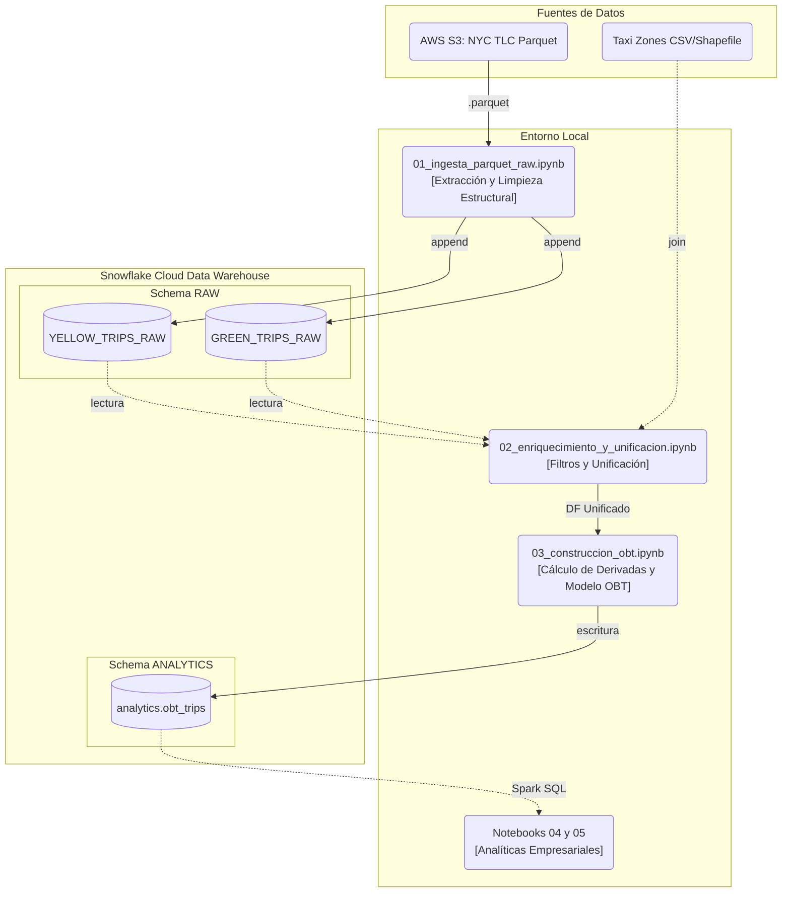

# Proyecto P3 – Ingesta de Datos con PySpark y Snowflake

## Integrantes
Leandro (00325644),
Esteban Silva (00329204),
Matías Jaramillo (00326063)

---

## Descripción del Proyecto

En este proyecto se implementa una pipeline básica de ingesta de datos utilizando datasets de taxis de NYC (Yellow y Green).

El objetivo es leer los datos en formato Parquet, estandarizar su esquema y cargarlos en Snowflake como capa RAW (Bronze Layer).

---

## Tecnologías Utilizadas

- Python 3.11
- Pandas
- PySpark
- Snowflake
- Docker / Docker Compose
- Jupyter Notebook

---

## Cómo Ejecutar el Proyecto

1. Levantar el entorno

docker compose up -d

2. Abrir Jupyter

http://localhost:8888

3. Ejecutar el notebook

Abrir y correr completo:
notebooks/01_ingesta_parquet_raw.ipynb

## Arquitectura (Gráfico)

## Pruebas Realizadas (oo_test_snowflake.ipynb, test_snowflake.ipynb, test-spark.ipynb)

- Verificación de conexión a Snowflake
- Inserción de datos usando write_pandas
- Consultas de validación (COUNT, SELECT LIMIT)
- Prueba de conexión con PySpark hacia Snowflake

### test-spark.ipynb
Comprueba la conexión entre Spark

### test_snowflake_connection.ipynb
Comprueba la conexión entre Spark y Snowflake

### 00_test_snowflake.ipynb
Crea la tabla YELLOW_TRIPS_RAW y GREEN_TRIPS_RAW en Snowflake con sus columnas respectivas

### 01_ingesta_parquet.ipynb

Si incertan datos de prueba y se compruebas las columnas y tipos de datos. Se prueba snowflake y spark.

---

## Arquitectura de Ingesta Masiva (01_ingesta_parquet_raw.ipynb)

El archivo `01_ingesta_parquet_raw.ipynb` centraliza nuestro motor principal de ingesta a nivel masivo y funciona de la siguiente manera:

1. **Iteración Temporal (Scraping):** El pipeline hace un loop para años y meses (desde 2015 hasta 2025) y descarga dinámicamente los archivos en formato Parquet provistos utilizando `urllib`. Se guardan a un sub-directorio local temporal `data/`. Se aplica un descarga y un borrado por cada archivo de manera que el disco de la computadora no se llene.

`link: https://d37ci6vzurychx.cloudfront.net/trip-data/{color}_tripdata_{year}-{month_str}.parquet`

2. **Transformación PySpark:** 
Se leen en caliente y se castean columnas incompatibles usando Spark nativo (Ej: El formato nativo `TimestampNTZType` de Spark 3.4 se transforma forzosamente a `TimestampType` iterando el `.schema` para evitar incompatibilidades con Snowflake JDBC).

3. **Inyección de Metadata:** Se agregan metadatos esenciales para trazabilidad analítica de la base de datos (`run_id`, `source_year`, `source_month`, `service_type` y `ingested_at_utc`).

4. **Carga Idempotente en el a Snowflake:** Para evitar la duplicación de datos en re-ejecuciones de un mismo año/mes, el conector usa intensivamente el parámetro `.option("preactions", delete_query)`. Esto garantiza que los registros correspondientes al viaje, año y mes exactos se supriman por completo desde servidor en Snowflake antes de escribir los nuevos.

### Mecanismo de Reintentos

A lo largo de 10 años de registros (2015-2025) de una entidad gubernamental, existen discrepancias que obligaron a formular celdas especiales de **"Reintento" (Manejo de Errores)** integradas en el pipeline:

- **Evolución Imprevista de Esquema (Data Drift 2025+):** Los archivos de la comisión TLC de NY a partir de Enero 2025 agregaron una columna general extra, desincronizando las celdas dimensionales que Snowflake esperaba posicionalmente.

- **Tolerancia a Excepciones HTTP 403 / Archivos Aún no Públicos:** Los meses de taxis de fin de año del corriente año a veces sufren de un delay en su subida. Retornando `HTTP Error 403: Forbidden`. Por lo que se tuvo que relizar de nuevo un reejecucion de estos batches

---

## Arquitectura de Enriquecimiento y Unificación (02_enriquecimiento_y_unificacion.ipynb)

## Arquitectura construccion OBT (03_construccion_obt.ipynb)

## Arquitectura de validacion (04_validaciones_y_reportes.ipynb)

## Arquitectura de analisis (05_analisis_exploratorio_y_visualizacion.ipynb)

